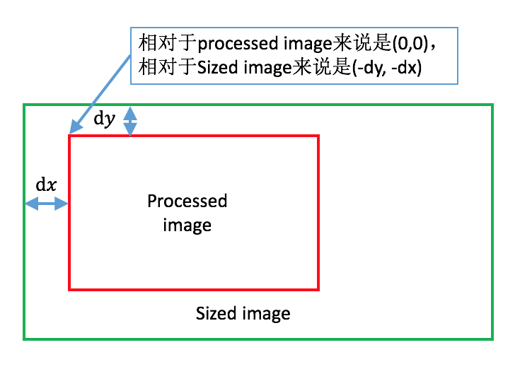
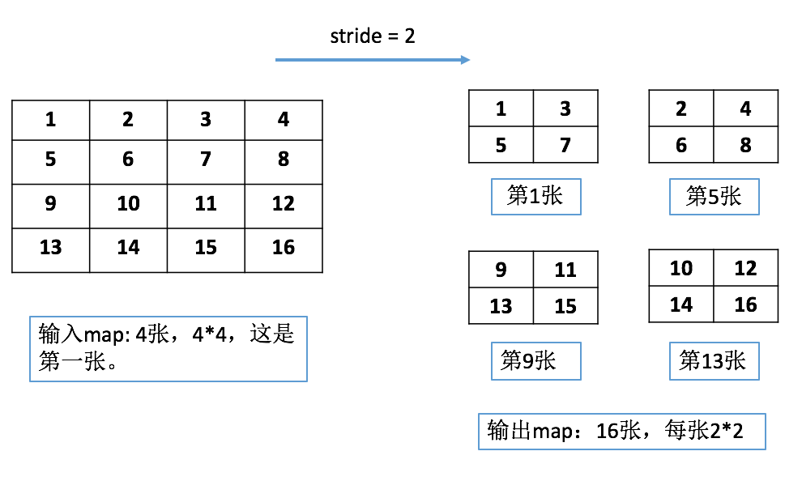
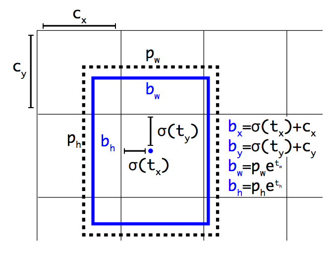

# YOLOv2的tensorflow版本

原文请参考：[YOLOv2 paper](https://pjreddie.com/media/files/papers/YOLO9000.pdf)。

注：本工程只实现了YOLOv2，并没有实现YOLO9000。

## 安装

```Shell
cd $YOLO_ROOT/lib
./make.sh
```
以上步骤是为了生成region layer和reorg layer的动态链接库（.so），供tensorflow调用。

## 代码说明

### `tools/convert.py`

作用：将darknet格式的模型文件转化为python格式（.npy）。

darknet格式
* 以float型数组格式存储，其blob数据格式与Caffe一样，即卷积层参数为[c_o, c_i, h, w]，全连接层参数为[c_o, c_i]。
* 模型参数从数组的第5个数据开始，前四个参数分别是：major, minor, revision and net.seen，可以忽略这四个参数的作用。
* 以带BN的卷积层为例，说明参数的存储，可参考[parser.c](https://github.com/pjreddie/darknet/blob/cd5d393b46b59dc72a5150436e70fa91a2918b2d/src/parser.c).从函数`save_convolutional_weights`可以看到，模型的写入顺序是先`biases`->`scales`->`rolling_mean`->`rolling_variance`->`weights`。因此，按相同的顺序，计算好各个参数的个数，就可以顺利读取了。

部分模块说明：
* class `graph`: 根据darknet的cfg文件，将模型结构存储，主要是保存每一层的输入输出大小。如果当前层的输入和前面某些层相关（Resnet的dropout结构），那么通过这个类就可以很方便地得到输入数据的维度。
* function `convert_tf`: `count`变量用于记录当前读取的数据段（`net_weights`）的起始位置（注意`net_weights`已经去掉了前面的4个参数）。`count`每次需要移动多少主要是根据cfg文件提供的模型参数来定。
命名规则上，我只是简单地为每一个层都单独分配一个号码。比如前三层结构是input-conv-conv，那么这三层的名字将分别是'net1', 'conv2', 'conv3'.

备注：目前`convert`函数只支持部分层的参数读取，如果需要增加其它的层，可以参考darknet里的`parser.c`.

### 加入自己的数据集
* 所有的数据集类都需要继承基类`imdb`，`imdb`规定了一些接口，比如供外部提取数据集的`get_batch(self, w, h)`方法；并且定义了一些成员变量，如`classes`, `image_names`等，供外界
获取该数据集的一些信息。同时`imdb`中还设计了数据增强函数`process_image(self, image, boxes, sized_w, sized_h)`，所有的子类都可以调用该函数进行数据增广。
* 图像增强：
    * 先对图像的长宽比，大小进行扰动（`new_ratio`, `scale`），请注意这里`scale`是针对输出图像而言的，也就是根据训练所需的图像大小而言的。
    * 将扰动后的图像放入输出图像容器中，放置的位置是随机的，由`dx`和`dy`决定。下面我画一个图来说明，这里假设resize之后的图像比输出图像要大，因此我们只能裁出其中一部分来作为输出（dx，dy都是负数）：
<div align=center></div>
    * 然后是在HSV空间随机扰动hue, saturation以及exposure。那部分代码写得比较长，其实就是RGB->HSV->RGB的一个过程。
    * 最后，根据对图像的扰动，对相应的gt_box也需要做相应的扰动。`box_x_scale`和`box_y_scale`是将`sized image`的量度转化到`processed image`中去，因为标签数据是以原始图像为基准进行归一化的，如上所述，
现在是将resize之后的图像塞到输出图像中，因此bounding box的归一化也必须针对输出图像（processed image）。由此也可以推知`box_x_delta`和`box_y_delta`是如何计算的。
* 在初始化自己的数据集类的时候（__init__(self, image_set, year = 2007, data_argument = True)），需要注意如下事项：
    * 成员变量`self._classes`: 只包括前景，背景不作一类
    * 需要实现`read_annotations()`方法，该方法按顺序读取图像的绝对路径，以及其对应的ground truth boxes。在实现`get_batch_data(self, w, h)`时，注意feed给`process_image`
    的图像数据以及标签都是经过归一化的，其中标签数据格式[cls_idx, xc, yc, w, h]，这里cls_idx是目标所属的类对应的标号，xc, yc是bounding box的中心，w和h是
    候选框的长宽，它们对以宽/高进行了归一化。若不需要调用`process_image`（也就是不需要进行图像增强），则请调用`resize_image_keep_ratio`以及`resize_label_keep_ratio`方法获得所需大小的
    图像和标签。
    * 类方法`_get_next_batch_inds(self)`以及`_shuffle_inds(self)`: 这是为了随机选取训练样本而设计的计数变量。当本次epoch中剩余数据不足以生成一个batch时，则开启新的epoch。
    * 在类方法中还需要实现evaluation function。在`pascal_voc`类中提供了evaluation的模板，用于计算mAP。
* 将数据集加入到`factory.py`中: 这里用`__sets`存放了不同名称的数据集实例，比如`__sets[pascal_voc_train]`和`__sets[pascal_voc_test]`。在读取数据集的时候直接调用`get_imdb(name)`
即可获得相应的数据集，调用通用接口`get_batch(self, w, h)`就可以得到batch数据。
* 关于kitti数据集：由于我之前用darknet做训练时，按照其要求先将数据转化成归一化的[cls_idx, xc, yc, w, h]格式。所以在`read_annotation`这个函数中我设置了两种读取annotation的方式，
`screen=True`表示经过预先处理的；而`screen=False`，则需要重新读取原始annotation文件。


### Reorg层（也叫passthrough层）
这一层有点类似于GoogLeNet的inception，就是将来自不同分支的feature map按照channel轴拼接到一起，要求这些分支的feature map大小是一样的。Darknet的想法是把浅层特征和深层特征结合到一起，提高网络的表达能力。
其中深层特征的feature map大小只有浅层特征的一半，因此需要将浅层特征的大小变为一半（长和宽, stride=2），思想是把相邻的元素分开放在不同的channel。我们用如下一张图来说明：

<div align=center></div>

具体的操作可以查看`reorg_op.cc`的`shard`部分。`shard`是个多线程管理模块，你可以不必知道它是如何运作的，只需要知道如何读取feature map某个位置的元素即可。在那里代码看起来很复杂，那是因为我
是将darknet关于reorg层的实现[reorg_cpu](https://github.com/pjreddie/darknet/blob/master/src/blas.c)给照搬过来，前面已经说过darknet和tensorflow的blob数据格式是不一样的。对照着darknet的代码
来看会比较好理解。

从图中也可以看到，这样划分的方式似乎还是不太好。比如1，2，5，6应该分别放在四个不同的channel，但是darknet上实现的就是如图所示那样。

### Region层
这一层的功能主要是为了计算loss。总结一下大概是做了两件事情（region_op.cc）：
* 对于每个predicted box，寻找与其最匹配的gt_box，并且计算overlap。若overlap > thresh，则暂时将confidence loss设为0；否则计算confidence loss = predicted_confidence - 0
(因为这些box的confidence应该是0，也就是没有检测到任何目标)。
* 对于每个gt_box，寻找与其overlap最大的predicted box（唯一），并且为该predicted box计算confidence loss, regression loss, classification loss等。也就是说，只有部分的predicted box
会得到训练，而其余的摇摆人（虽然overlap > thresh，但是不被任何gt_box锁定），则不计算loss（也就是不对它们进行训练）。可以看出这是一种“精英训练”的策略。

接下来说明一下loss是如何计算。我们首先关注一下最后的卷积层，`conv30`。这一层其实已经给出了预测结果。它有box_num * (class_num + 5)那么多个channel，其中`5`包含了：confidence，目标的
bounding box，每个box都有5+class_num那么多预测值。对于feature map中的每个像素点（对应于原图中的某一块区域，感受野），它都会产生box_num个box信息。参考论文可知，我们会预先对训练数据的bounding
box进行聚类，得到box_num种bounding box的大小作为先验信息（长，宽）。实际上，预测的bounding box的信息是针对于先验信息的偏移。可以用如下的图来解释：

<div align=center></div>

在上图中，pw和ph是bounding box的先验宽高，tx和ty是预测的宽、高偏移量，sigma函数是指losgistic函数(1/(1+exp(-x))，见`logistic`函数)，目的是为了将预测值限制在[0, 1]范围内。

在YOLOv2中，bounding box的值是经过归一化的，比如上图中的cx = 1，表示当前计算的网格相对于feature map在x轴上偏移了1个单位，1个单位的长度 = 图片宽度/网格数目。换言之，如果将bx乘以图像真实的宽度，
就可以得到中心点对应于原图的真实位置。可以看到，bx与cx的值不会超过1（中心点就限制在当前网格内），所以需要限制预测值的范围。预测值tw和th可以认为是一个缩放比例。

这里没有给出confidence的计算，实际上就是logistic(t0)，也是一个[0, 1]范围内的数值。我们希望的是confidence = prob_obj(检测到物体为1，没检测到位0) * iou(与最匹配的gt_box的overlap)。

对于classes的预测值，是用softmax函数(exp(xi)/sigma(exp(xi)))将其限制在[0, 1]范围内，在`region_op.cc`中可以看到（`softmax`函数）。

tensorflow不允许修改feature map的输入像素值，所以可以看到我在多处地方都重新计算了预测值的logistic值。对于不同的loss，定义了不同的scale，可以在config文件中查看。

注意，计算bounding box的loss时：实际上是计算logistic(tx), logistic(ty), tw, th以及t0的L2 loss，可以参考`delta_coord`函数；对于classification loss，计算的是交叉熵损失函数。
可以证明对于交叉熵损失函数对应的梯度与L2 loss对应的梯度是一致的，对于第j类都是: 1(y == j) - p(y=j|x), 当样本y的真实label为j时1(y == j) = 1。可以参考[UFLDL](http://ufldl.stanford.edu/wiki/index.php/Softmax_Regression)
中关于softmax函数的梯度计算。不同的是，在`region`层中，没有可训练的参数theta。

关于backward pass计算：logistic函数求导值为f(x) * (1-f(x))（tx, ty, t0）。对于classification的gradients，则直接是backward回来的值。前面已经说过，交叉熵损失函数的梯度
和L2 loss对应的梯度是一致的，而我们计算loss时实际上是按照L2 loss来进行计算的，因此所得到的梯度就是我们所需要的梯度值，不需要进行二次转化。

另外，tensorflow返回的是“梯度”而不是“负梯度”，因此计算梯度时只需要计算“正梯度”值。

### 训练
训练采用的是单机多卡模式（data parallel）。只需要运行`tools`目录下的`train.py`文件，在文件开头的全局变量`DATASET`中你需要指定训练所使用的数据集。然后调用`lib/solver`
中的`SolverWrapper`类，传入参数：
* `imdb`: 由`factory`的`__sets[name]`提供。
* `snapshot_infix`: 存放中间模型文件的倒数第二层目录，用于区分不同数据集所得模型的存放路径。
* `pretrained_model`: 使用ImageNet训练过的base model（绝对路径）。

关于单机多卡训练：参考`tensorflow-GoogLeNet`工程。

在训练的过程中，会不断地调整输入图像的大小（每10个batch调整一次，都是32的倍数），这是为了使得模型能够适应不同分辨率的图像输入。

### 测试
目前只写了关于`PASCAL_VOC`数据集的测试代码。

在文件`tools/test.py`中，可以看到`test_net()`函数。该函数从数据集类中获取所有图像数据的绝对路径，并且对每一张图像调用`inference.py`中的`detect`函数，获取所有的predicted
bounding boxes，存放在`all_boxes[cls][image_name]`中：

`all_boxes[cls][image_name]`: 是一个以二维矩阵为元素的二维矩阵，每个元素代表的是`image_name`指定的图像中`cls`类的所有predicted bounding boxes。每个元素的每一行
是`[xc, yc, w, h, confidence]`格式。

在`lib/datasets/pascal_voc.py`中，重写了`imdb`的`evaluation_detections`函数。该函数首先建立n个文件，每个文件对应一个类别的目标，存放该类目标所在的图像，其位置
以及confidence等信息，用于为每一类单独评价mAP。文件生成后调用`_evaluate_mAP(self, classname)`函数，

`_evaluate_mAP(self, classname)`: 先将该类所有的目标按confidence进行递减排序，然后confidence高者优先匹配gt_box。被匹配的gt_box不能被其他的predicted box匹配，这时
那些predicted box就会被标记为fp。然后调用`_voc_ap(self, rec, prec, use_07_metric = True)`计算ap。具体请详细阅读代码，理解起来并不困难。（这部分其实来源于
`faster-rcnn`工程）
